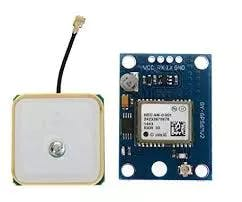

# GY-NEO6MV2 (GPS Module)

## Table of Contents
- [Intro](#intro)
- [Component](#component)
- [Connections](#connections)
- [Test Code](#test-code)
  - [Test result](#test-result)
- [Troubleshooting](#troubleshooting)
- [References](#references)
    
---

## Intro
The NEO-6M GPS module is shown in the figure below.<br/>
<br/>
It comes with an external antenna and does not come with header pins. So you will need to solder it.<br/>
To test the example below, you may need some [libraries](Library/) in the [Library](Library/) folder.

---

## Component
* Please click the link with 'Ctrl' key or 'CMD' key, if you would like to open the link in a new tab!

- [GY-NEO6MV2 (GPS Module)](https://www.trademe.co.nz/electronics-photography/other-electronics/electronic-components/other/listing-2675623928.htm?rsqid=59019109183e48c6b9adc939d6defd37-002)
- [Arduino Uno R3 MEGA328P CH340](https://www.trademe.co.nz/electronics-photography/other-electronics/electronic-components/other/listing-2651898157.htm?rsqid=929e0e9ffa584c05a4e74094cd4b87c6-004/)

---

## Connections
### GPS pinout
|  |
| -- |


### Circuit Image
|  |
| -- |
| Source: https://create.arduino.cc/projecthub/ruchir1674/how-to-interface-gps-module-neo-6m-with-arduino-8f90ad#toc-1--information-about-gps-0 |

---

## Test Code
* To test this example with arduino, you need to define the libraries used for the GPS module. You can download the libraries from [library](Library/u8glib_arduino_v1.18.1.zip) folder in this page.

```c++
/*
 * Rui Santos 
 * Complete Project Details https://randomnerdtutorials.com
 *
 * Based on the example TinyGPS++ from arduiniana.org
 *
 */
 
#include <TinyGPS++.h>
#include <SoftwareSerial.h>

static const int RXPin = 4, TXPin = 3;
static const uint32_t GPSBaud = 9600;

// The TinyGPS++ object
TinyGPSPlus gps;

// The serial connection to the GPS device
SoftwareSerial ss(RXPin, TXPin);

void setup(){
  Serial.begin(9600);
  ss.begin(GPSBaud);
}

void loop(){
  // This sketch displays information every time a new sentence is correctly encoded.
  while (ss.available() > 0){
    gps.encode(ss.read());
    if (gps.location.isUpdated()){
      // Latitude in degrees (double)
      Serial.print("Latitude= "); 
      Serial.print(gps.location.lat(), 6);      
      // Longitude in degrees (double)
      Serial.print(" Longitude= "); 
      Serial.println(gps.location.lng(), 6); 
       
      // Raw latitude in whole degrees
      Serial.print("Raw latitude = "); 
      Serial.print(gps.location.rawLat().negative ? "-" : "+");
      Serial.println(gps.location.rawLat().deg); 
      // ... and billionths (u16/u32)
      Serial.println(gps.location.rawLat().billionths);
      
      // Raw longitude in whole degrees
      Serial.print("Raw longitude = "); 
      Serial.print(gps.location.rawLng().negative ? "-" : "+");
      Serial.println(gps.location.rawLng().deg); 
      // ... and billionths (u16/u32)
      Serial.println(gps.location.rawLng().billionths);

      // Raw date in DDMMYY format (u32)
      Serial.print("Raw date DDMMYY = ");
      Serial.println(gps.date.value()); 

      // Year (2000+) (u16)
      Serial.print("Year = "); 
      Serial.println(gps.date.year()); 
      // Month (1-12) (u8)
      Serial.print("Month = "); 
      Serial.println(gps.date.month()); 
      // Day (1-31) (u8)
      Serial.print("Day = "); 
      Serial.println(gps.date.day()); 

      // Raw time in HHMMSSCC format (u32)
      Serial.print("Raw time in HHMMSSCC = "); 
      Serial.println(gps.time.value()); 

      // Hour (0-23) (u8)
      Serial.print("Hour = "); 
      Serial.println(gps.time.hour()); 
      // Minute (0-59) (u8)
      Serial.print("Minute = "); 
      Serial.println(gps.time.minute()); 
      // Second (0-59) (u8)
      Serial.print("Second = "); 
      Serial.println(gps.time.second()); 
      // 100ths of a second (0-99) (u8)
      Serial.print("Centisecond = "); 
      Serial.println(gps.time.centisecond()); 

      // Raw speed in 100ths of a knot (i32)
      Serial.print("Raw speed in 100ths/knot = ");
      Serial.println(gps.speed.value()); 
      // Speed in knots (double)
      Serial.print("Speed in knots/h = ");
      Serial.println(gps.speed.knots()); 
      // Speed in miles per hour (double)
      Serial.print("Speed in miles/h = ");
      Serial.println(gps.speed.mph()); 
      // Speed in meters per second (double)
      Serial.print("Speed in m/s = ");
      Serial.println(gps.speed.mps()); 
      // Speed in kilometers per hour (double)
      Serial.print("Speed in km/h = "); 
      Serial.println(gps.speed.kmph()); 

      // Raw course in 100ths of a degree (i32)
      Serial.print("Raw course in degrees = "); 
      Serial.println(gps.course.value()); 
      // Course in degrees (double)
      Serial.print("Course in degrees = "); 
      Serial.println(gps.course.deg()); 

      // Raw altitude in centimeters (i32)
      Serial.print("Raw altitude in centimeters = "); 
      Serial.println(gps.altitude.value()); 
      // Altitude in meters (double)
      Serial.print("Altitude in meters = "); 
      Serial.println(gps.altitude.meters()); 
      // Altitude in miles (double)
      Serial.print("Altitude in miles = "); 
      Serial.println(gps.altitude.miles()); 
      // Altitude in kilometers (double)
      Serial.print("Altitude in kilometers = "); 
      Serial.println(gps.altitude.kilometers()); 
      // Altitude in feet (double)
      Serial.print("Altitude in feet = "); 
      Serial.println(gps.altitude.feet()); 

      // Number of satellites in use (u32)
      Serial.print("Number os satellites in use = "); 
      Serial.println(gps.satellites.value()); 

      // Horizontal Dim. of Precision (100ths-i32)
      Serial.print("HDOP = "); 
      Serial.println(gps.hdop.value()); 
    }
  }
}
```
| Source: https://randomnerdtutorials.com/guide-to-neo-6m-gps-module-with-arduino/|
| -- |

---

## Test result
1. [Result video](https://drive.google.com/file/d/1_RN-WhjaQx6hA6DZcNWvWJTLq-q7KFiV/view?usp=sharing)
2. [Connection](https://drive.google.com/file/d/1xHgAFgHzxB_ud4lzYgxZgfGU4RV7nqe0/view?usp=sharing)

---

## Troubleshooting

- Check the pinout
  - To test above example, you have to check the pinout.(especially RX and TX.)
  - The digital pin 4 of arduino is RX (connect to TX of GPS Module)
  - The digital pin 3 of arduino is TX (connect to RX of GPS Module)

  

- When you change the pins in the code, make sure the connection of RX and TX.

---

## References
- Site:
  - [Tutorial 1](https://lastminuteengineers.com/neo6m-gps-arduino-tutorial/)
  - [Tutorial 2](https://www.instructables.com/id/How-to-Communicate-Neo-6M-GPS-to-Arduino/)
  - [Tutorial 3](https://randomnerdtutorials.com/guide-to-neo-6m-gps-module-with-arduino/)

- Data Sheet
  - [https://www.u-blox.com/sites/default/files/products/documents/NEO-6_DataSheet_(GPS.G6-HW-09005).pdf](https://www.u-blox.com/sites/default/files/products/documents/NEO-6_DataSheet_(GPS.G6-HW-09005).pdf)
